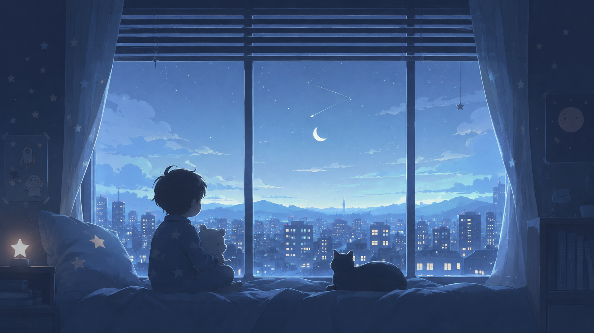

# Cozy Night — an Omarchy Kids theme

A calm, starry **dark** theme for kids: the cool, dependable **Nord** palette paired with OldJobobo's kid-safe night-time wallpapers — a child and their teddy watching the moon from a cozy window, a warm cocoa counter on a quiet blue street, and a wonder-filled starry adventure.



> The preview is a placeholder (the wallpaper itself). Replace it with a real desktop screenshot after installing.

## Install

```bash
omarchy-theme-install https://github.com/kenhara/omarchy-cozy-night-theme
```

While this repo is private (pre-review), install over SSH instead:

```bash
omarchy-theme-install git@github.com:kenhara/omarchy-cozy-night-theme.git
```

Then choose **Cozy Night** in the Omarchy theme picker.

## What's inside

- `colors.toml` — the **Nord** palette, reused verbatim (`mode = "dark"`)
- `backgrounds/` — kid-safe wallpapers: `cozy-nightscape.png`, `nighthawk-cocoa.png`, `oh-my-ethereal.png`
- `icons.theme` — `Yaru-blue`
- `unlock.png` — lock-screen background

Nothing here is invented: the colors are an existing Omarchy palette, and the only new material is the reviewed kid wallpapers. See [`NOTES.md`](NOTES.md) for the full rationale.

> Note: `oh-my-ethereal.png` is a wonderful fit visually, but its palette really belongs to Omarchy's `ethereal` theme rather than Nord — it's included here for now but flagged in `NOTES.md` for review.

## Credits

- **Wallpapers & visual design:** OldJobobo
- **Palette:** reused from Omarchy's **Nord** theme
- **Draft implementation:** Harris / kenhara
